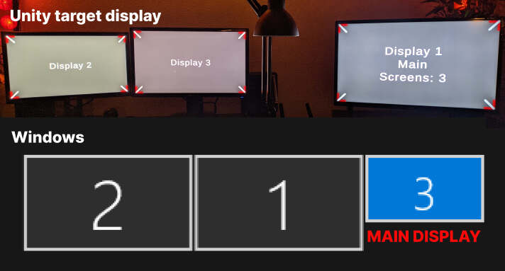

# unityTargetDisplayOrderDetector

**Version 1.0**

## Introduction

This tool provides a quick and easy way to determine how Unity orders display outputs on your setup.\
It helps you identify the correct output camera display by showing the order in which Unity detects your monitors.

## How to Use

1. Download the latest build: `unityTargetDisplayOrder_v1.X.zip
2. Extract the contents of the zip file
3. Run `unityTargetDisplayOrder.exe`

## How Does Unity Order Its Display Outputs?

- **Display 1** will always be the main display.
- The remaining displays are ordered as follows using your Windows screens placement:
  - The display positioned furthest to the left
  - The display positioned highest
